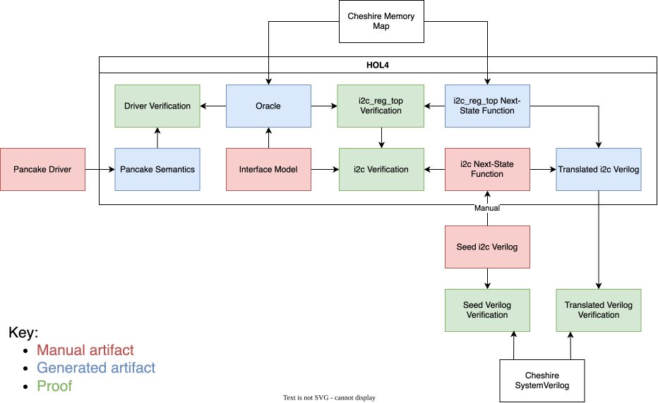

# Background

The aim of this repository is to formalise the interface of Cheshire I2C (and other peripherals), and then verify its driver against that interface.

Cheshire I2C consists of two main components: `i2c_reg_top`, which is in charge of managing the storage behind the core's memory-mapped I/O registers and handling accesses to them, and `i2c_core`, which contains the main logic.

`i2c_reg_top` is autogenerated from a `hjson` file in the Cheshire repo describing Cheshire I2C's memory map; so, we can use this file to autogenerate all of our models of it.

# Dependencies

- [The HOL theorem prover, commit a81865b9bac5e3018a070980ce8f4a392c66c9c6](https://github.com/HOL-Theorem-Prover/HOL/tree/a81865b9bac5e3018a070980ce8f4a392c66c9c6)
- [CakeML, commit c6b44e05125d687eeb829f8ee4e1dc5c32228839](https://github.com/CakeML/cakeml/tree/c6b44e05125d687eeb829f8ee4e1dc5c32228839)
- [Our fork of Andreas Lööw's Verilog semantics](https://github.com/au-ts/cakeml-hardware/tree/device-specification)

# Plan

The hardware verification will be performed by manually simplifying/translating the hardware into HOL next-state functions, using CakeML/hardware's translator to turn them back into Verilog, and then equivalence-checking that Verilog against the original SystemVerilog.

Since the translator doesn't support submodules, `i2c_reg_top` will be defined separately as a collection of isolated processes, which will then be added into the list of processes in the top-level module.

To verify `i2c_reg_top` separately from the main logic of the I2C core, the plan is to try and prove a theorem saying that if the rest of the core behaves the same as `i2c_tick`, then the whole thing will behave the same as `i2c_oracle`; and then the aim of the main verification will be to satisfy that assumption.

Intended proof chain:

# Contents of this repository

- `util`: scripts which generate various things based on Cheshire's memory maps:

  - `util/gen_regs.py`: Record types containing all the non-`hwext` registers of a peripheral, and 'notification' types for telling the interface model when accesses with potential side effects have occured.
    - Side effects are helpfully annotated in the memory map.
  - `util/gen_mappings.py`: The main functions defining what happens when you read/write to an address in the interface model, calling out to manually-defined functions for `hwext` registers and returning notifications for accesses to registers with side effects.
  - `util/gen_regs_comm.py`: Type definitions for `reg2hw` and `hw2reg`, the interfaces for communicating between `i2c_core` and `i2c_reg_top`.
  - `util/gen_regs_circuit.py`: The HOL version of `i2c_reg_top`.
  - `util/eqy_prepare.py`: The translated version of `i2c_reg_top` is actually the full I2C core, but with only the `always` blocks for `i2c_reg_top` included. So, this script is needed to change the port declaration to that of `i2c_reg_top`, and change `reg2hw` and `hw2reg` from local variables into ports.
  - `util/common.py`: Shared code.

- `i2c/i2cCoreScript.sml`: The main part of the interface model, which consists of the functions that `i2cMappingsTheory` calls into as well as `i2c_tick` for defining what happens to the circuit's internal state on each clock cycle.
- `common/sharedMemoryOracleScript.sml`: A helper (`sh_mem_oracle`) for defining FFI oracles that only support shared memory, without having to deal with any of the FFI glue, as well as a theorem (`sh_mem_oracle_sh_mem_load`) that shared memory loads from an oracle using this helper get through the FFI glue intact.
- `common/byteExtraScript.sml`: Helpers for proving `sh_mem_oracle_sh_mem_load` which should be upstreamed into HOL at some point.
- `common/cheshireOracleScript.sml`: Helpers for driving the interface model: this includes `cheshire_run` for invoking it directly, and `cheshire_oracle` for converting it to an FFI oracle.
- `i2c/i2cScript.sml`: Defines the top-level oracle for the I2C interface model.
- `examples/basic.pnk`: An _extremely_ simple Pancake program which performs a single read from one of Cheshire I2C's registers.
- `examples/basicScript.sml`: An example verification of `basic.pnk`, to test that my model can be successfully connected with Pancake's semantics.

- `common/cheshireCircuitScript.sml`: Type definitions and helpers related to Cheshire's register bus.
- `i2c/i2cCircuitStateScript.sml`: Defines the state for the HOL version of Cheshire I2C, so that it can be used by `i2cRegsCircuitLib`.
- `i2c/i2cCircuitScript.sml`: Defines the top-level module for the HOL version of Cheshire I2C, currently a stub which just includes `i2c_reg_top`.
- `i2c/i2cRegsCircuitProofScript.sml`: The proof that if `i2c_core` behaves the same as `i2c_tick`, then `i2c_reg_top` behaves the same as `i2c_oracle`.
- `i2c/i2cCoreCircuitProofScript.sml`: The (incomplete) proof that `i2c_core` behaves the same as `i2c_tick`.

- `i2c/i2c_reg_top.eqy`: `eqy` configuration for equivalence-checking the translated version of `i2c_reg_top` against the real one.
  - This will probably be removed once the HOL version of the rest of the circuit is done, since then we can equivalence-check it all at once and don't need to deal with hacks like `eqy_prepare`.
- `i2c/i2c_reg_top_wrapper.sv`: A wrapper around `i2c_reg_top` which instantiates `reg_req_t` and `reg_rsp_t`, as well as fixing `devmode_i` to 1.
